# RAG 手法リファレンス

## 0. 基本 RAG パイプライン

すべての手法のベースとなる基本構成。

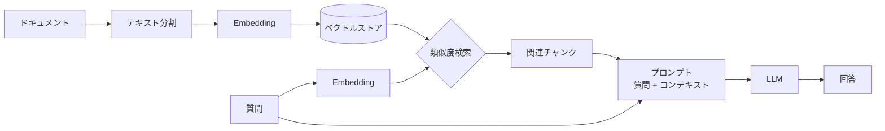

以降の各手法は、このパイプラインの**特定のステージを改善**するもの。

---

## 1. チャンク戦略の改善

テキスト分割 → Embedding の段階を改善する手法群。

### 1-1. チャンクサイズ・オーバーラップ調整

チャンクの大きさと重複幅が検索精度に与える影響を比較する。

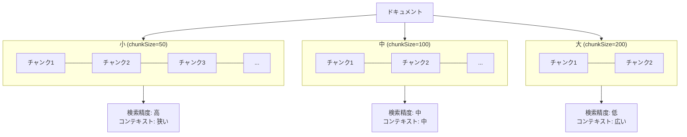

- **小チャンク**: ピンポイントで該当箇所を見つけやすいが、周辺文脈が欠落する
- **大チャンク**: 文脈は豊富だがノイズも混入しやすい
- **オーバーラップ**: チャンク境界で情報が切れるのを防ぐ

### 1-2. セマンティックチャンキング

文字数ではなく**意味の境界**でテキストを分割する。

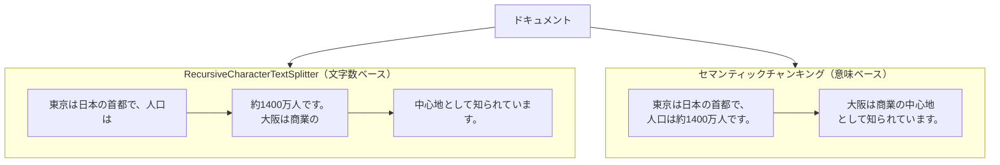

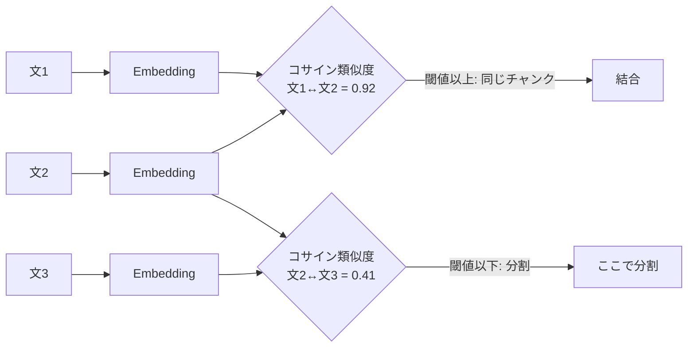

- 隣接する文の Embedding 間のコサイン類似度を計算
- 類似度が閾値を下回った箇所で分割する
- 意味的にまとまった単位でチャンクが生成される

### 1-3. 親子チャンク（ParentDocumentRetriever）

**小さいチャンクで検索精度を確保**しつつ、**大きいチャンクで文脈を提供**する。

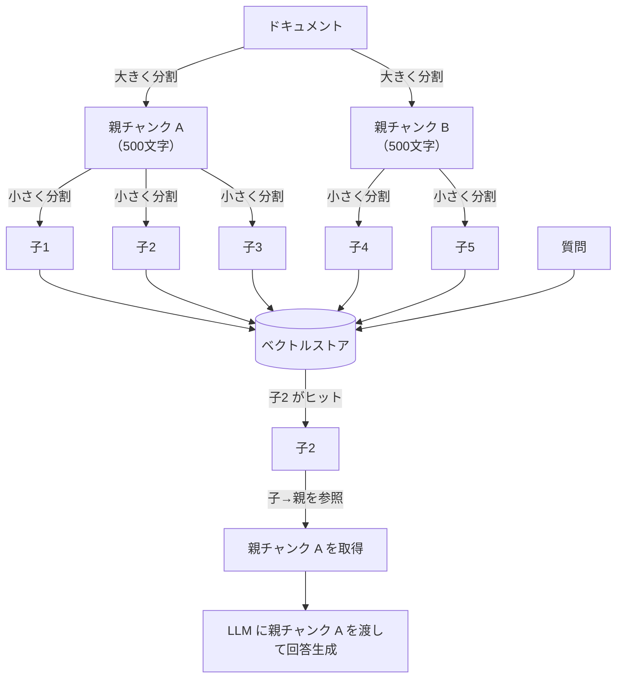

- 子チャンクはベクトルストアに格納（検索用）
- 親チャンクは InMemoryStore に格納（コンテキスト提供用）
- 検索で子がヒット → 対応する親チャンクを LLM に渡す

---

## 2. 検索の改善

類似度検索 → 関連チャンク取得の段階を改善する手法群。

### 2-1. Top-K 調整

取得件数 k の値が回答品質に与える影響を比較する。

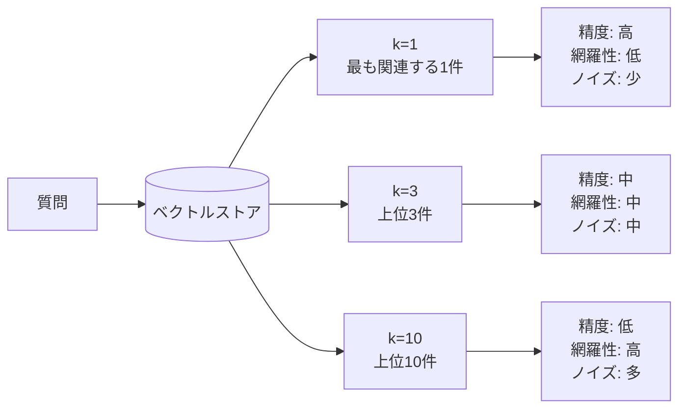

- k が小さすぎると必要な情報を取りこぼす
- k が大きすぎると無関係な情報がコンテキストに混入し、回答が劣化する

### 2-2. マルチクエリ（MultiQueryRetriever）

1つの質問を**複数の言い換え**に変換して検索の網羅性を高める。

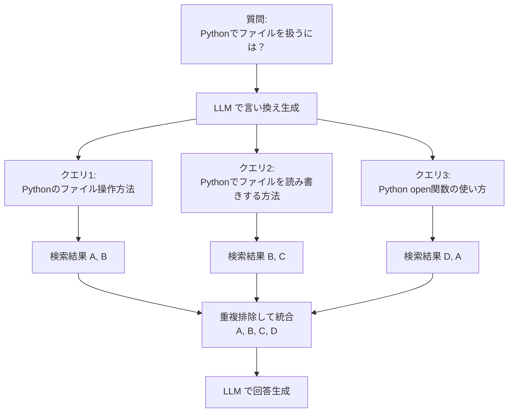

- 単一クエリでは表現の揺れにより見逃すチャンクを拾える
- 複数クエリの結果を重複排除して統合する

### 2-3. ハイブリッド検索（ベクトル + BM25）

**ベクトル検索**（意味的な類似度）と **BM25**（キーワードマッチ）を組み合わせる。

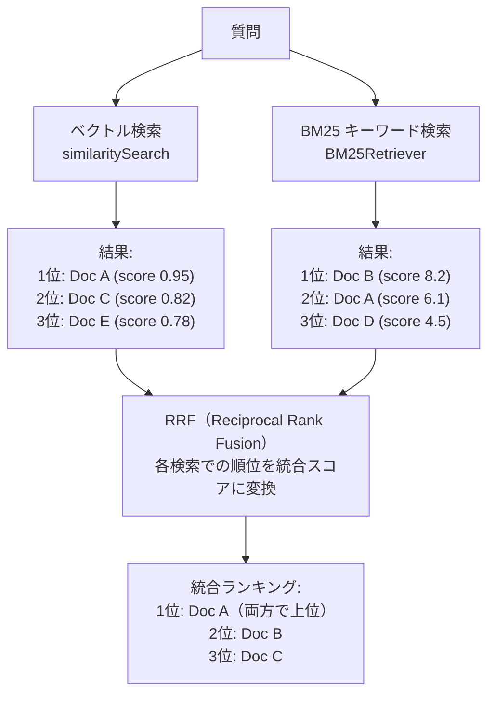

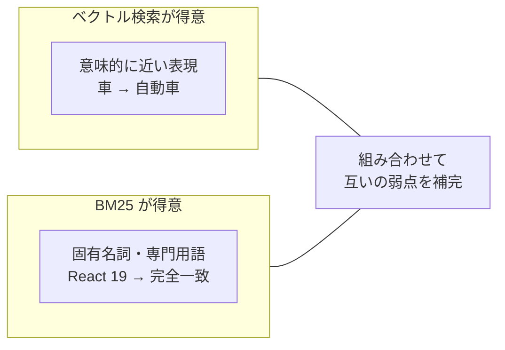

- ベクトル検索は意味的な類似度は捉えるが、固有名詞の完全一致に弱い
- BM25 はキーワードの一致に強いが、同義語や言い換えに弱い
- RRF: `score = Σ 1/(k + rank)` で各検索結果の順位を統合

### 2-4. リランキング

ベクトル検索の結果を**より精密なモデルで並べ替える** 2段階方式。

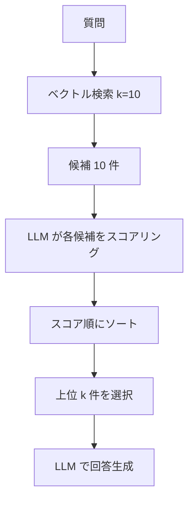

#### Bi-Encoder（ベクトル検索）

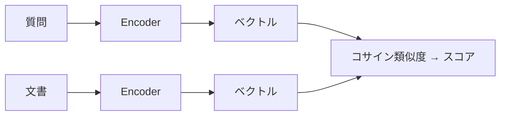

- 質問と文書を**別々に**ベクトル化して比較
- 高速・事前計算可。精度は中程度

#### Cross-Encoder

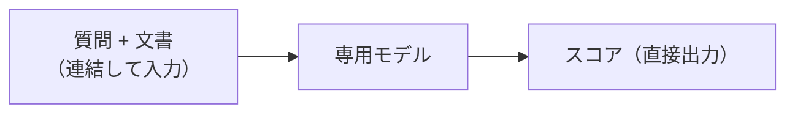

- 質問と文書を**連結して1つのモデル**に入力し、スコアを直接出力
- 高精度だが JS/TS でのローカル実行が困難

#### LLM リランキング（今回採用）

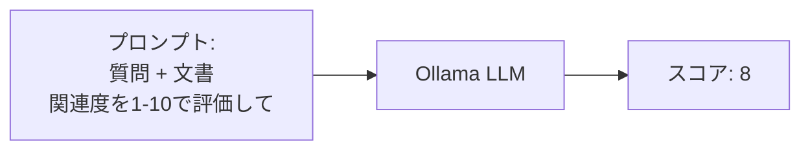

- **Bi-Encoder**: 質問と文書を別々にベクトル化→比較。高速だが精度に限界
- **Cross-Encoder**: 質問と文書を連結して1つのモデルに入力→スコアを直接出力。高精度だが JS/TS 環境でのローカル実行が困難
- **LLM リランキング**: 汎用 LLM にプロンプトでスコアリングさせる。Cross-Encoder の役割を LLM で代替

---

## 3. 回答生成の改善

関連チャンク → LLM → 回答の段階を改善する手法群。

### 3-1. Map-Reduce

各チャンクを**個別に処理**してから結果を**統合**する。

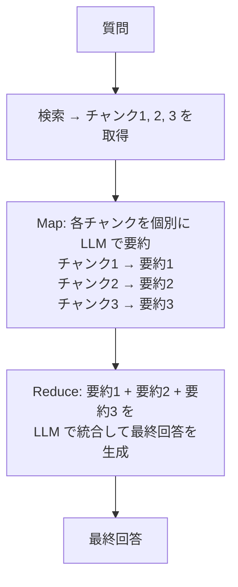

- 各チャンクを独立に処理するため**並列実行が可能**
- 長文にまたがる情報の統合に有効
- LLM 呼び出し回数が多い（チャンク数 + 1 回）

### 3-2. Refine

チャンクを**順番に読みながら回答を段階的に改善**していく。

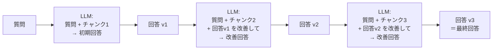

- チャンクを逐次処理するため**前の回答を踏まえた改善**ができる
- 並列実行はできない（逐次処理）
- 後のチャンクほど回答への影響が大きくなるバイアスがある

### Map-Reduce vs Refine 比較

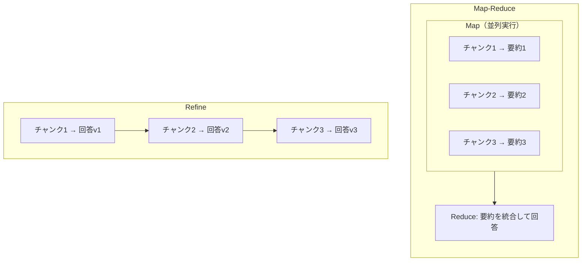

|  | Map-Reduce | Refine |
|--|-----------|--------|
| 処理 | 並列処理可能 | 逐次処理のみ |
| 偏り | チャンク間の偏りなし | 後のチャンクにバイアス |
| 弱点 | 統合時に情報が落ちうる | 低速 |
| 適性 | 独立した情報の統合 | 文脈を引き継ぐ改善 |
